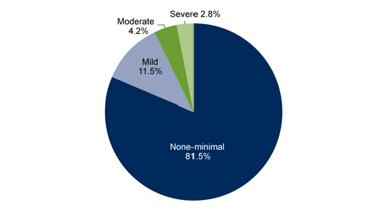

# MindWell
 
Mental health is as important as physical health. So, here's a web app to help improve our emotional well-being.

## Introduction

Through this website, my aim is to provide personal and interactive guidance regarding mental health issues and provide ways to resolve them.

## Configuration

For this project, you'll need Node.js, Express.js, HTML, CSS, and JavaScript.

To setup the development environment you need node, npm , express, ejs .

## Reports

this is the report of symptoms of depression among adults aged 18 and over.

This shows the importance of such websites.

## Details

Upon visiting the website, you'll first see an inspiring quote. Below that are four sections:

* The first one to analyze depression.
* The second to analyze anxiety.
* The third provides personal, real-time guidance through an AI doctor.
* The last offers information on how to cure them.

## Key features and challenges faced

The main feature of this project is the use of the Gemini API key and creating a server using Express.js . 

Initial goal was to integrate openAI API for the AI therapist feature, but techincal issues led to explore different alternatives. So I worked on gemini API and then came real challenge to make the server and configure GET and POST requests.

## Try It Out:

Below is the link for live deployment of the project.

https://mind-well.onrender.com

